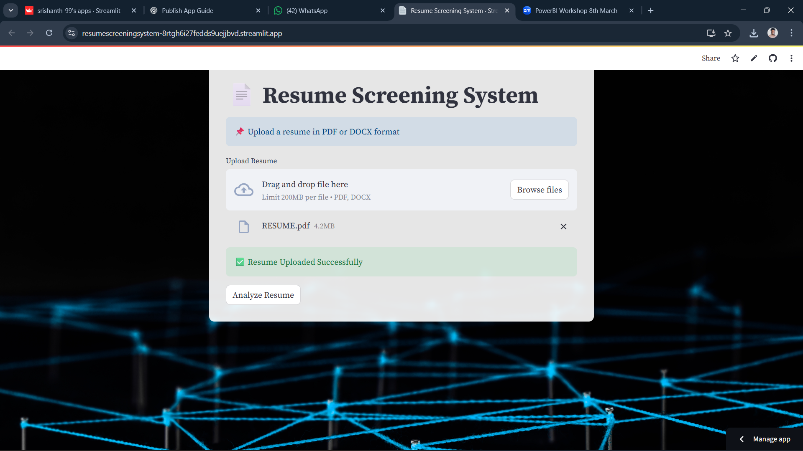
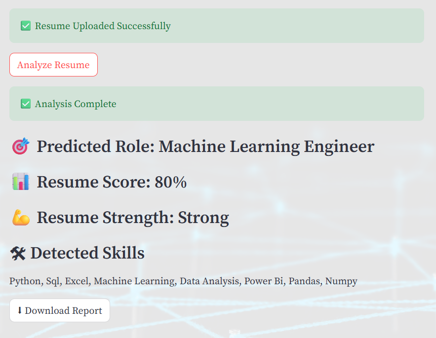
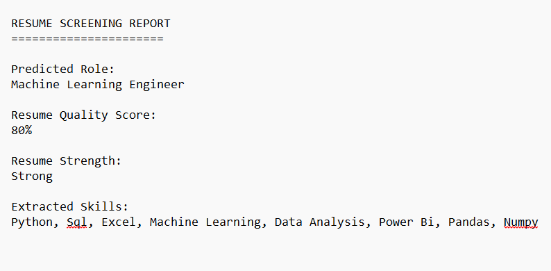

# AI Resume Screening System

An intelligent **AI-based Resume Screening System** that analyzes resumes and predicts suitable job roles based on extracted skills.
This system helps recruiters and organizations quickly evaluate candidate resumes using **Machine Learning and Natural Language Processing (NLP)**.

---

## 🚀 Live Demo

🔗 **Open the Application:**
https://resumescreeningsystem-8rtgh6i27fedds9uejjbvd.streamlit.app

---

## 📌 Features

* Upload resumes in **PDF or DOCX format**
* Automatic **resume text extraction**
* **Skill detection** from resume content
* **Job role prediction** using machine learning
* Generate **resume analysis report**
* User-friendly web interface

---

## 🛠️ Tech Stack

* **Python**
* **Streamlit**
* **Scikit-learn**
* **Pandas**
* **Natural Language Processing (NLP)**

---

## 📂 Project Structure

```
resume_screening_system
│
├── app.py
├── train_model.py
├── requirements.txt
├── upload.png
├── analysis.png
├── report.png
├── utils
│   └── __init__.py
├── backend
└── assets
```

---

## 📸 Project Screenshots

### Resume Upload Page



### Resume Analysis



### Resume Report



---

## ⚙️ Installation

### 1️⃣ Clone the Repository

```
git clone https://github.com/srishanth-99/RESUME_SCREENING_SYSTEM.git
```

### 2️⃣ Go to Project Folder

```
cd RESUME_SCREENING_SYSTEM
```

### 3️⃣ Install Required Libraries

```
pip install -r requirements.txt
```

### 4️⃣ Run the Application

```
streamlit run app.py
```

The application will open in your browser.

---

## 🎯 Future Improvements

* ATS Score calculation
* Job description matching
* Resume ranking system
* Multiple resume comparison
* Better AI skill extraction

---

## 👨‍💻 Author

**Srishanth Nani**

Final Year Student – Data Science
Interested in **Artificial Intelligence, Machine Learning, and Data Science**

---

⭐ If you like this project, consider giving it a **star** on GitHub!
